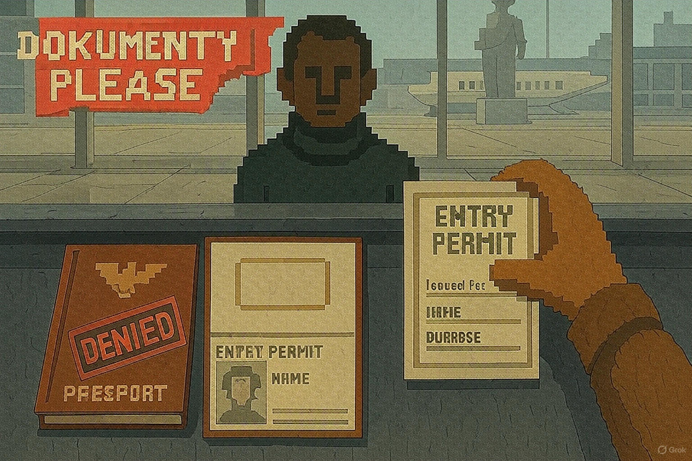

# 🎮 *Dokumenty Please*

### 🧑‍🤝‍🧑 **Integrantes**  
Ariel Leiva, Franco Bernal, Hugo Palomino, Felipe Romero  

### 🧾 **Asignatura**  
Estructura de Datos (ICI2240-2)  

### 📅 **Fecha de entrega**  
nose cuando se entrega XDDD
00-00-2030  

<div align="center">



---

### 📸 **Presentación del equipo**

<table>
  <tr>
    <td align="center">
      <br/>
      <strong>Franco Bernal</strong>
    </td>
    <td align="center">
      <br/>
      <strong>Ariel Leiva</strong>
    </td>
    <td align="center">
      <br/>
      <strong>Felipe Romero</strong>
    </td>
    <td align="center">
      <br/>
      <strong>Hugo Palomino</strong>
    </td>
  </tr>
</table>

</div>

---


## 🚀 ¿Cómo ejecutar el juego?

### 🟢 Opción 1: Ejecutar el archivo

Puedes ejecutar el juego directamente haciendo doble clic en el archivo `run` que se encuentra en la carpeta del proyecto.
Esto abrirá automáticamente una consola con el juego corriendo.

---

### 🛠️ Opción 2: Compilar manualmente

1. Abre la consola de Visual Studio Code.
2. Compila el programa con el siguiente comando:

```bash
gcc main.c src\extra.c src\hashmap.c src\heap.c src\list.c src\map.c src\menu.c -o bin\run.exe
```

3. Luego ejecútalo con:

```bash
bin\run.exe
```

---

### 🔧 Requisitos previos (sólo si deseas compilarlo manualmente)

- Tener instalado **Visual Studio Code.**
- Instalar la extensión para **C/C++**.
- Tener instalado un compilador para C, como **MinGW.**

---

### 📂 Archivos requeridos (Incluídos en el juego)

- `/bin`: almacena el código compilado.
- `/data`: datos que requiera el juego para funcionar (audios, imágenes, etc..)
- `/include` y `/src` : funciones ordenadas que necesita el juego.
- `main.c` : código base del juego.

---

### 🔨 Comentario como grupo

- Como grupo nos fue muy fácil trabajar, programamos siempre juntos, ya sea presencialmente o por discord, por lo que el trabajo fue equitativamente bien distribuido. No tuvimos ningún tipo de inconveniente al realizar el juego.

---

### 🐞 Posibles problemas encontrados

- **Soporte**: solo Windows, usuarios de MacOS podrían tener dificultades ejecutando el programa.
- **Entrada inválida**: si se ingresan caracteres cuando se solicita un número, el programa puede trabarse.
- **NO LLEVAMOS NADA XD**: provlema prinsipal a solusionar.
